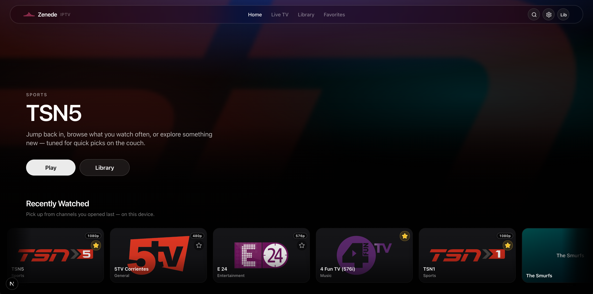
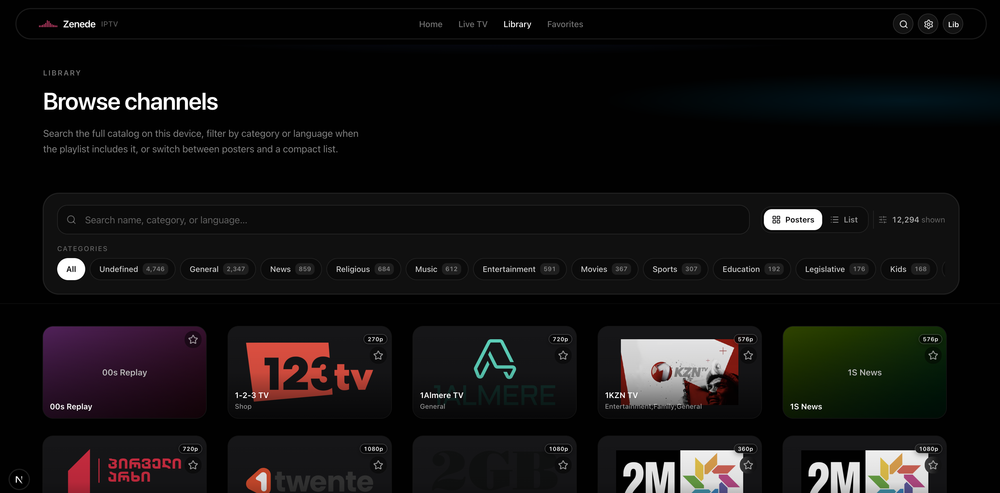
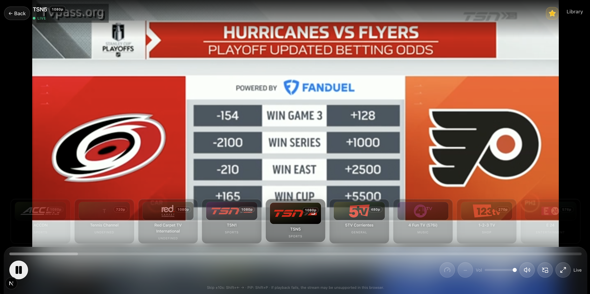

# Zenede

Web IPTV client: browse M3U catalogs, watch in the browser, and optionally route **each channel** through its own VPN or HTTP proxy. Zenede does not host or transcode video.

## Screenshots

|  |  |  |
| :---: | :---: | :---: |

## Main features

| Feature | What it does |
|--------|----------------|
| **Catalog & library** | Loads allowlisted M3U sources (default: [iptv-org](https://github.com/iptv-org/iptv) world index), search, categories, grid/list, optional health hints when the server stores scores. |
| **Playback** | HLS-oriented live playback in the browser; stream URLs come from your catalog. Cookie-aware relay for picky CDNs. |
| **VPN / proxy per channel** | In **Settings → VPN Proxies**, define **direct HTTP/SOCKS proxies** or spin up **Gluetun** VPN containers (NordVPN, ExpressVPN, ProtonVPN, custom OpenVPN/WireGuard). Use **Channels** on a proxy to assign **specific streams**; only those channels exit through that tunnel. Unassigned channels stay direct. |
| **IPTV players** | **Settings → Integrations**: portal keys for **Xtream-style** apps (e.g. TiviMate) — `player_api.php`, `get.php`, `xmltv.php`, `/live/...` URLs on the same host. |
| **Auth & multi-user** | Optional login (JWT), admin user management, per-user favorites and history when enabled. |
| **Persistence** | SQLite (local or Docker volume) for catalog cache, registry, proxies, portal credentials, sessions. |

Legal note: the default index links to third-party streams; you are responsible for rights and local law. See iptv-org’s [legal section](https://github.com/iptv-org/iptv#legal).

## Quick start (Docker)

**Requirements:** Docker with Compose v2.

```bash
mkdir -p ./gluetun-work
docker compose up --build
```

Open **http://localhost:8077** (or set `PORT` / `DOCKER_PUBLISH` in `.env` — see [Advanced setup](docs/ADVANCED.md)).

For production, set a strong **`AUTH_JWT_SECRET`** in `.env`. Behind a reverse proxy, ensure **`Host`** and **`X-Forwarded-Proto`** (or **`Forwarded`**) reach the app so HLS URLs rewrite correctly; use **`PUBLIC_APP_URL`** only if headers are missing.

## Quick start (local dev)

```bash
npm install
npm run dev
```

Default port **8077**; override with **`PORT`** in `.env`. Copy **`.env.example`** → **`.env`** if you need a custom `DATABASE_URL`.

## Documentation

* **[Advanced setup](docs/ADVANCED.md)** — iptv-org pipeline, full Docker/env reference, VPN/Gluetun details, per-channel assignment, Xtream portal notes, authentication, cron/health jobs.

## Summary

Zenede is an M3U-first IPTV front-end with optional **per-channel VPN routing** via Gluetun or static proxies, optional **Xtream-compatible** URLs for external players, and optional auth. It does not redistribute stream content.
