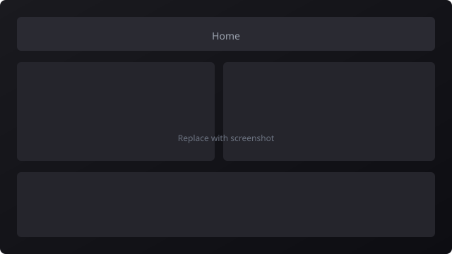
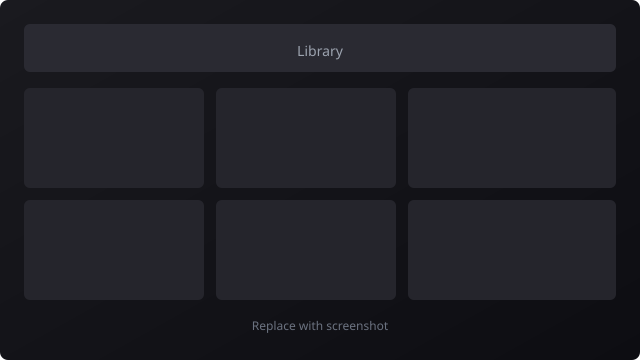
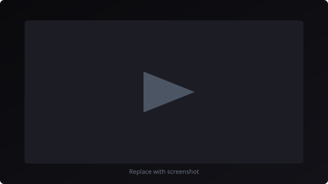

# Zenede

## Screenshots

|  |  |  |
| :---: | :---: | :---: |

Zenede is a web application for browsing M3U playlists and playing stream URLs in the browser. It does not host or transcode video. The default catalog integration uses the public **iptv-org** index as a fixed, allowlisted playlist source.

## Overview

| Area | Description |
|------|-------------|
| Catalog | Parses M3U playlists into structured channels (name, stream URL, optional logo, group metadata). |
| Library | Search, grouping by playlist categories, list or grid layouts, optional health indicators when the server stores scores. |
| Playback | In-browser playback (HLS-oriented for live streams). Channel order in navigation follows the loaded catalog and local usage data, not broadcaster channel numbers. |
| Storage | Large catalogs are cached in **IndexedDB**. Optional **SQLite** (local or Docker volume) supports channel registry, health jobs, and optional authentication. |

The built-in playlist points at the iptv-org world index. Zende is a client for opening third-party stream URLs from that index; it is not an IPTV subscription service and does not redistribute streams.

## iptv-org integration

The project **[iptv-org/iptv](https://github.com/iptv-org/iptv)** publishes a **CC0** aggregate playlist:

`https://iptv-org.github.io/iptv/index.m3u`

Zende registers this URL as the built-in preset in [`src/config/builtin-playlist-sources.ts`](src/config/builtin-playlist-sources.ts):

* **Preset ID:** `iptv-org-world-index`
* **Source URL:** `https://iptv-org.github.io/iptv/index.m3u`
* **Attribution:** Follow iptv-org’s license and documentation; the repository stores links, not media.

### Built-in catalog flow

1. **Allowlist.** The server exposes `GET /api/playlists/builtin/[presetId]` only for known preset IDs mapped to fixed URLs. Arbitrary user-supplied URLs are not fetched server-side (SSRF mitigation).
2. **Fetch.** For the iptv-org preset, the route retrieves the upstream `index.m3u` and returns the raw body to the client.
3. **Parse.** The client parses `EXTINF` and stream URL lines into structured records.
4. **Cache.** Parsed data is stored in IndexedDB per preset to avoid full re-download each session.
5. **Registry (optional).** Metadata may sync into SQLite-backed registry and health features when those options are enabled.

Streams are operated by third parties. Zende does not re-host streams; playback uses the URL from the playlist in the browser player. Legal and availability considerations for the index are described in the **[iptv-org Legal](https://github.com/iptv-org/iptv#legal)** section of their repository.

## Local development

```bash
npm install
npm run dev
```

By default the app listens on port **8077** (see **`PORT`** in **`.env.example`**). To use another port, set **`PORT`** in **`.env`** or in the environment before starting (for example `PORT=9000 npm run dev` on Unix shells).

Copy **`.env.example`** to **`.env`** if you need to override `DATABASE_URL` (defaults to a local SQLite file for Prisma) or **`PORT`**.

## Docker

**Requirements:** Docker with Compose v2 (`docker compose`).

From the repository root:

```bash
docker compose up --build
```

Then open **http://localhost:8077**.

On first start the container adjusts ownership of the `/data` volume for SQLite, runs `npx prisma db push`, then starts the application.

| Topic | Detail |
|-------|--------|
| HTTP port | Host **8077** maps to container **8077** (override in Compose if needed). |
| Database file | **`/data/zende.db`** in the container for registry, health data, and optional auth users. |
| Volume | Named volume **`zende-data`** mounted at **`/data`** persists across `docker compose down`; remove data only with `docker compose down -v`. |
| Browser state | Viewing statistics, tokens, and UI preferences remain in the browser, not in SQLite. |

Set environment variables under `services.zende.environment` or via `env_file`:

| Variable | Required | Purpose |
|----------|----------|---------|
| `DATABASE_URL` | Yes (defaults in Compose) | Prisma SQLite URL; use `file:/data/zende.db` with the bundled volume. |
| `PORT` | Optional | HTTP port inside the container and on the host (default **8077**). |
| `AUTH_JWT_SECRET` | Strongly recommended in production | Signs JWTs when authentication is enabled. |
| `CRON_SECRET` | Optional | `Authorization: Bearer` for cron and related HTTP APIs. |
| `LOG_LEVEL` | Optional | Server log level (e.g. `info`). |

Do not commit secrets; inject them via the host or your orchestrator.

Stop containers while keeping the volume:

```bash
docker compose down
```

Stop and delete the named volume (wipes server-side SQLite):

```bash
docker compose down -v
```

Compose includes a **healthcheck** on `GET /api/health`. Wait until the service is **healthy** before routing production traffic.

```bash
docker compose logs -f zende
docker compose exec zende sh
```

## Authentication (optional)

The application runs without login by default. **Settings → Authentication** can require sign-in, create the initial administrator account, and manage additional users.

* **`AUTH_JWT_SECRET`:** Use a long random value in production. It signs access and refresh tokens. Development may use a fallback; do not rely on that in production.
* **`CRON_SECRET`:** Separate from JWT signing. Protects scheduled and registry-style routes via `Authorization: Bearer`. Both may be set on one deployment for different endpoints.

### Reset bootstrap administrator

If the first administrator credentials are lost, run inside the container:

```bash
docker compose exec zende node scripts/reset-bootstrap-admin.cjs --username admin --password 'your-new-password'
```

Requires `DATABASE_URL` and a password of at least eight characters.

## Scheduling and hosting

For automated registry or health sweeps, set **`CRON_SECRET`** and configure callers to send `Authorization: Bearer <CRON_SECRET>`.

* From **Settings → Server**, operators may store the same secret for browser-initiated calls to protected routes, or call APIs from scripts with the Bearer header.
* **Nightly health:** `GET /api/cron/nightly-health` on your deployment’s base URL. Schedule with host **cron**, **systemd** timers, **Kubernetes CronJob**, **Nomad**, **GitHub Actions** `schedule`, or any job runner that can issue HTTPS GET with the header.

Example host cron entry (05:00 UTC daily):

```bash
0 5 * * * curl -fsS -H "Authorization: Bearer YOUR_CRON_SECRET" https://your-domain.example/api/cron/nightly-health >/dev/null
```

Job schedulers in other runtimes (for example Quartz on the JVM or APScheduler in Python) are suitable if they can perform that request on the desired interval.

These features are optional for local use of the iptv-org catalog; they matter when running a persistent registry and automated checks in production.

## Summary

Zenede provides M3U-based browsing and in-browser playback. The default channel list comes from the iptv-org `index.m3u` through a fixed, server-allowlisted preset. Playback connects directly to stream URLs; this repository does not include transcoding.

Further playlist options and upstream documentation: **[iptv-org/iptv](https://github.com/iptv-org/iptv)** and **[PLAYLISTS.md](https://github.com/iptv-org/iptv/blob/master/PLAYLISTS.md)**.
